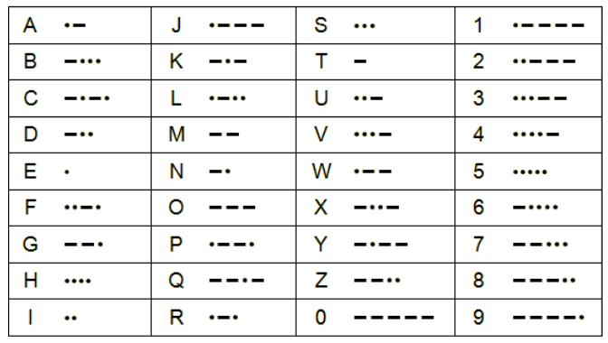
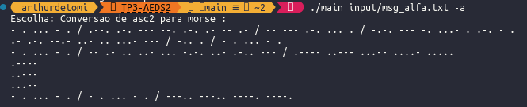
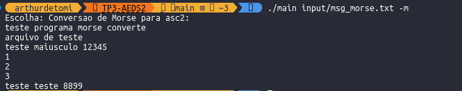

# Programa de Conversões (P/Morse <-> p/Alfa)

## Especificação do programa
- Link :[Especificação](documentacao/TP3.pdf)

## Depêndencias
Necessário ter instalado um compilador de linguagem C e o make.
- Distribuições Debian
```shell
sudo apt install build-essential cmake
```
##  Compilando o programa

Para compilar codigo
```bash
make 
``` 
Limpar arquivos binários
```bash
make clean
```

Programa utiliza árvore digital Trie para conversão de morse para alfanumérico ou vice-versa, pode-se inserir mais letras caso seja necessário, recomenda-se executar primeiro o programa da seguinte forma:

```bash
./main -i
```
Para exibir a árvore e os caracteres asc2 disponíveis, tambem é possivel inserir mais letras com os respectivos codigos morse desejados.
Ou utilizando a tabela:



## Rodando o programa

O diretório **input/** é destinado a colocar os arquivos **.txt** de entrada, cada resposta do servidor de morse para alfanumérico ou o contrário além de ser exibido no console também é criado uma arquivo de saída com o resultado da conversão para o diretório **/out** 

O programa para rodar utiliza argumentos, abaixo serão listados os argumentos disponíveis e exemplos:
- **-i** exibi os caracteres disponíveis na arvore morse e seus respectivos códigos morse:
Exemplo :
```bash
./main -i
```
- **-a** converte um arquivo com texto em alfanuméricos para morse
Exemplo :
```bash
./main input/<arquivo_alfa.txt> -a
```

- **-m** converte um arquivo com texto em morse para alfanumérico.
Exemplo :
```bash
./main input/<arquivo_morse.txt> -m
```

- **Desenvolvido por** : [Geraldo Arthur Detomi](https://github.com/ArthurDetomi) 


- **Documentação :** Rhayan e Rodrigo


